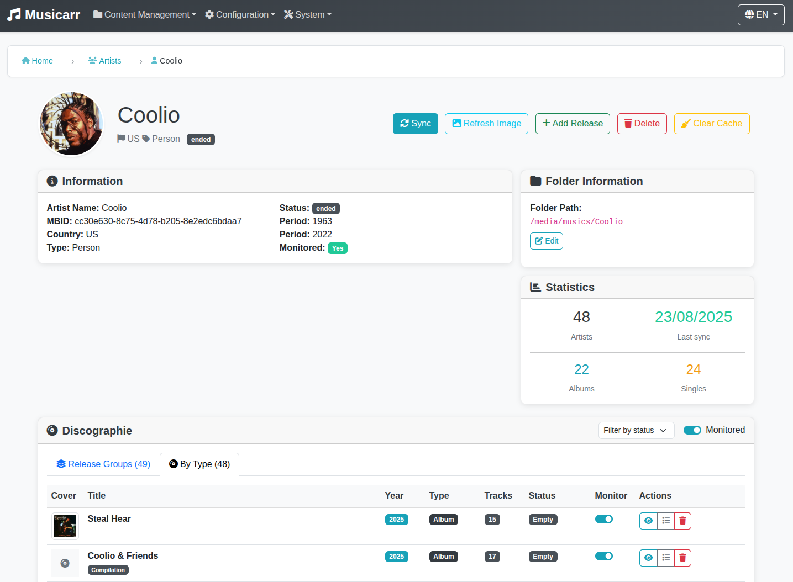

<p align="center">
  
</p>

# 🎵 Musicarr - Open Source Music Library Management

<p align="center">
  
</p>

> ⚠️ **WARNING: VERY EARLY STAGE PROJECT** ⚠️
> 
> This project is currently in **very early development** and was created as a **Proof of Concept (POC)**. 
> 
> - **Not production ready** - Use at your own risk
> - **Experimental features** - Many features are incomplete or may not work as expected
> - **Breaking changes** - The API and database schema may change frequently
> 
> This is primarily a learning project and demonstration of concepts. If you're looking for a production-ready music library management solution, please consider more mature alternatives.

Welcome to **Musicarr**, a comprehensive, open-source music library management solution built with Symfony and the MusicBrainz API.

## 🌟 What is Musicarr?

Musicarr is an **experimental POC** that demonstrates modern web application development concepts for music library management. It was built as a learning project to explore automated metadata retrieval, intelligent file organization, and comprehensive library management features using Symfony and modern web technologies.

**Current Status**: Very early stage development with core concepts implemented but many features incomplete or experimental.

## 🚀 Key Features

- **🎤 Artist Management**: Add, search, and synchronize artists with MusicBrainz
- **💿 Album Tracking**: Monitor albums and track new releases
- **📁 Library Organization**: Organize music into logical libraries and folders
- **🔍 Smart Matching**: Intelligent track matching and association algorithms
- **🎵 Audio Quality Analysis**: Analyze and track audio quality metrics
- **📊 Comprehensive Statistics**: Detailed library analytics and reporting
- **🌐 Modern Web Interface**: Responsive design with Bootstrap 5
- **🔌 RESTful API**: Full API for external integrations
- **🐳 Docker Support**: Complete containerized deployment
- **🔌 Plugin System**: Extensible plugin architecture with automatic discovery

## 🏗️ Technology Stack

- **Backend**: PHP 8.4+, Symfony 7.3, Doctrine ORM
- **Frontend**: Bootstrap 5, Stimulus.js, Twig templates
- **Database**: MariaDB/MySQL, SQLite support
- **Cache**: Redis for performance optimization
- **Testing**: PHPUnit, comprehensive test coverage
- **Quality**: PHP CS Fixer, PHPStan, PHPMD, GrumPHP
- **Plugin System**: Custom plugin architecture with automatic asset loading

## 📦 Quick Start

> **Note**: As this is a very early stage POC, the setup process may not be fully documented or tested. Some steps may require manual intervention or troubleshooting.

### Prerequisites
- PHP 8.4 or higher
- Composer
- Node.js and npm
- Database (MariaDB/MySQL, SQLite support)

### Installation

1. **Clone the repository**
   ```bash
   git clone https://github.com/TheGrimmChester/Musicarr.git
   cd musicarr
   ```

2. **Install dependencies**
   ```bash
   composer install
   npm install
   ```

3. **Build assets**
   ```bash
   npm run build
   ```

4. **Set up the database**
   ```bash
   # Create the database
   php bin/console doctrine:database:create
   
   # Run migrations
   php bin/console doctrine:migrations:migrate
   ```

5. **Start the development server**
   ```bash
   symfony server:start
   ```

### Docker Installation

For a quick start with Docker:

```bash
git clone https://github.com/TheGrimmChester/Musicarr.git
cd musicarr
docker-compose up -d
```

The application will be available at `http://localhost:8795`.

## 🔌 Plugin System

Musicarr features a comprehensive plugin system that allows you to extend functionality:

- **Automatic Discovery**: Plugins are automatically discovered from the `plugins/` directory
- **Asset Loading**: JavaScript controllers and CSS are automatically loaded
- **Remote Installation**: Install plugins directly from GitHub repositories
- **Task-Based Management**: Plugin operations run as background tasks
- **No Manual Configuration**: Plugins integrate seamlessly without editing core files

See the `docs/` directory for detailed plugin development and management documentation.

## 🤝 Contributing

Given that this is a very early stage POC, contributions are welcome but should be approached with the understanding that this is primarily a learning project. Here's how you can help:

### Ways to Contribute

- **🐛 Bug Reports**: Report bugs and issues (expect many in this early stage)
- **💡 Feature Requests**: Suggest new features and improvements
- **📝 Documentation**: Help improve documentation
- **🧪 Testing**: Test features and report issues (testing infrastructure is limited)
- **💻 Code**: Submit pull requests with improvements (be prepared for frequent changes)
- **🔌 Plugins**: Develop and share plugins to extend functionality

### Development Setup

1. **Fork the repository**
2. **Create a feature branch**
3. **Make your changes**
4. **Run tests**: `./vendor/bin/phpunit`
5. **Check code quality**: `./vendor/bin/grumphp run`
6. **Submit a pull request**

### Coding Standards

- Follow PSR-12 coding standards
- Write comprehensive tests
- Update documentation for new features
- Use conventional commit messages

## 📚 Documentation

- **Plugin System**: `docs/PLUGIN_SYSTEM_SUMMARY.md`
- **Plugin Assets**: `docs/README_PLUGIN_ASSETS.md`
- **Remote Plugin Discovery**: `docs/REMOTE_PLUGIN_DISCOVERY.md`
- **Remote Plugin Installation**: `docs/REMOTE_PLUGIN_INSTALLATION.md`
- **Task-Based Plugin System**: `docs/TASK_BASED_PLUGIN_SYSTEM.md`

## 📄 License

This project is licensed under the EUPL-1.2 License - see the LICENSE file for details.
